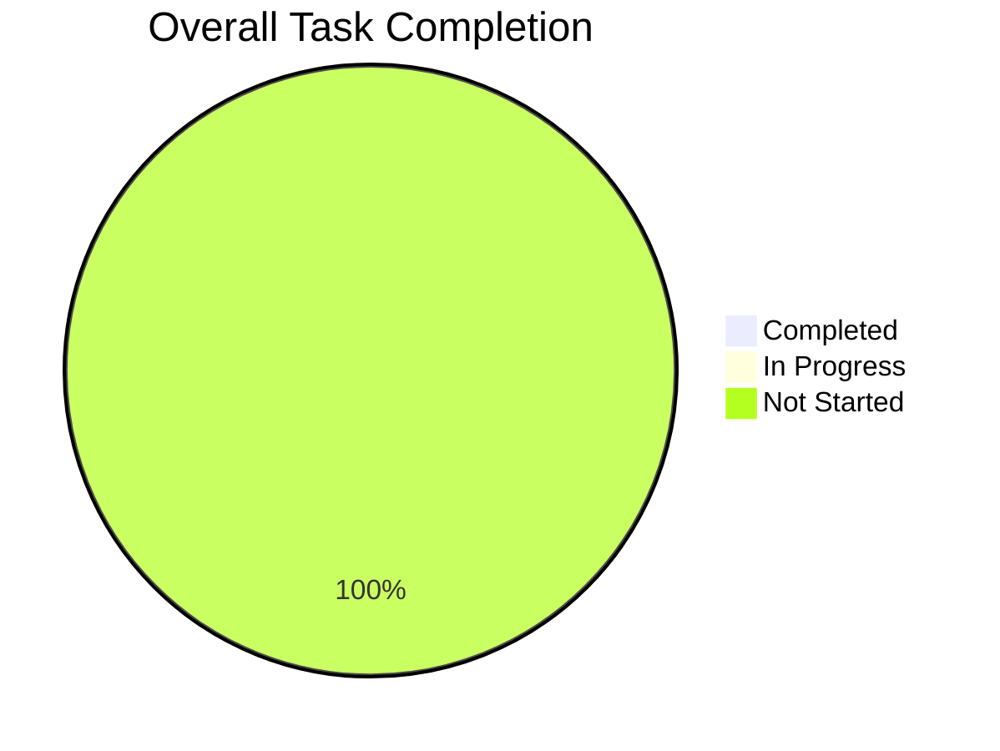
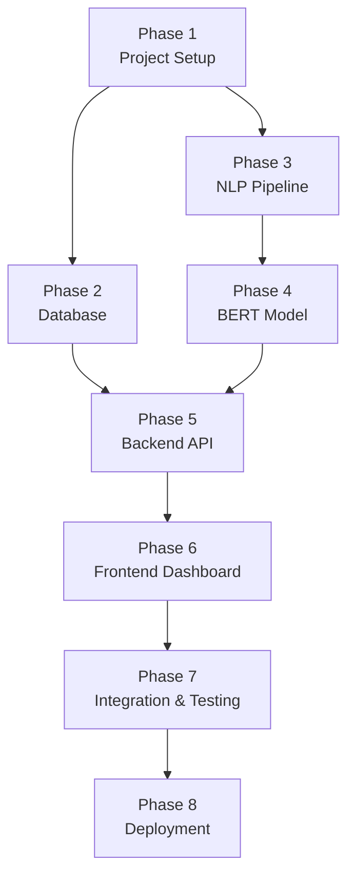
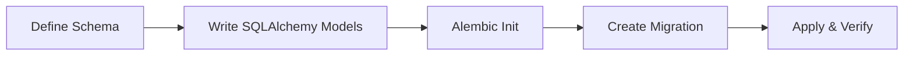
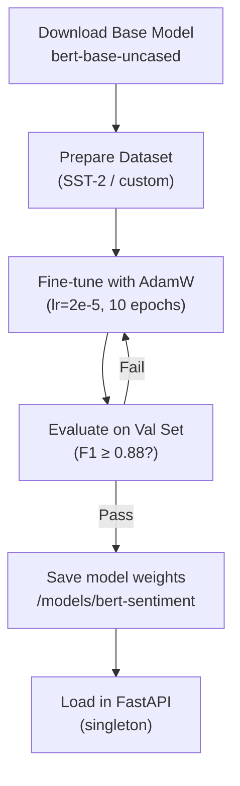
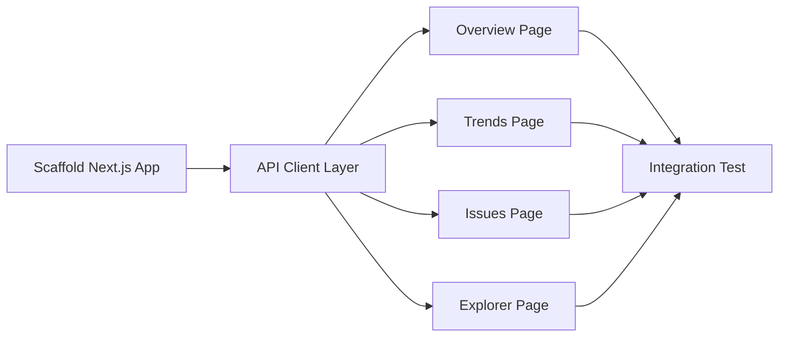

# Sentivex — Project Todo List

**Project:** AI Customer Sentiment Analysis Dashboard  
**Started:** 2026-05-29  
**Stack:** Python · PostgreSQL · Next.js · BERT  

---

## Progress Overview

---

## Task Dependency Map

---

## Phase 1 — Project Setup & Scaffolding

**Goal:** Establish project structure, tooling, and developer environment.

- [ ] **1.1** Create monorepo directory structure (`backend/`, `frontend/`, `docker/`)
- [ ] **1.2** Initialize Git repository and add `.gitignore` (Python, Node, env files)
- [ ] **1.3** Create `backend/requirements.txt` with all Python dependencies
  - `fastapi`, `uvicorn`, `sqlalchemy`, `alembic`, `psycopg2-binary`
  - `transformers`, `torch`, `scikit-learn`, `spacy`
  - `pydantic`, `python-dotenv`, `slowapi`
- [ ] **1.4** Create `frontend/package.json` and install Node dependencies
  - `next`, `react`, `recharts`, `tanstack/react-query`, `axios`
  - `shadcn/ui`, `tailwindcss`, `react-wordcloud`
- [ ] **1.5** Set up Python virtual environment and install dependencies
- [ ] **1.6** Create `.env` and `.env.local` templates (no real secrets)
- [ ] **1.7** Create `docker-compose.yml` with `fastapi`, `postgres`, `nextjs`, `nginx` services
- [ ] **1.8** Configure `nginx.conf` as reverse proxy for API and frontend
- [ ] **1.9** Verify all services start cleanly with `docker compose up`

---

## Phase 2 — Database Design & Setup

**Goal:** Design and implement the PostgreSQL schema with migrations.

- [ ] **2.1** Set up PostgreSQL container with `sentivex` database and user
- [ ] **2.2** Define SQLAlchemy ORM models in `backend/app/models/db_models.py`
  - `Source`, `Feedback`, `Prediction`, `TrendCache` tables
- [ ] **2.3** Initialize Alembic (`alembic init migrations`)
- [ ] **2.4** Configure Alembic `env.py` to use SQLAlchemy metadata
- [ ] **2.5** Generate initial migration (`alembic revision --autogenerate`)
- [ ] **2.6** Apply migration (`alembic upgrade head`)
- [ ] **2.7** Seed database with test `Source` records
- [ ] **2.8** Add database indexes as defined in `spec.md` section 6.2
- [ ] **2.9** Write `backend/app/db/session.py` — session factory with connection pooling
- [ ] **2.10** Write `backend/tests/test_db.py` — CRUD unit tests for all models

---

## Phase 3 — NLP Preprocessing Pipeline

**Goal:** Build robust, reusable text preprocessing for BERT input.

- [ ] **3.1** Download and install spaCy English model (`en_core_web_sm`)
- [ ] **3.2** Implement `TextPreprocessor` class in `backend/nlp/preprocessor.py`
  - Strip HTML tags, URLs, special characters
  - Lowercase and normalize whitespace
  - Language detection (reject non-English)
- [ ] **3.3** Implement `BERTTokenizerWrapper` in `backend/nlp/tokenizer.py`
  - Load `bert-base-uncased` tokenizer from HuggingFace
  - Support single and batch tokenization
  - Apply `max_length=512`, `truncation=True`, `padding="max_length"`
- [ ] **3.4** Create regex utility patterns in `backend/nlp/utils.py`
- [ ] **3.5** Write unit tests for preprocessor (edge cases: empty string, emojis, HTML, long text)
- [ ] **3.6** Benchmark preprocessing throughput (target: ≥ 500 items/sec)

---

## Phase 4 — BERT Sentiment Model

**Goal:** Fine-tune and serve a 3-class BERT sentiment classifier.

- [ ] **4.1** Define `BERTSentimentClassifier` in `backend/ml/model.py`
  - `BertForSequenceClassification` with 3 output labels
  - Dropout layer (p=0.3), softmax output
- [ ] **4.2** Prepare training dataset
  - Load SST-2 or custom feedback CSV
  - Map labels: 0=Negative, 1=Neutral, 2=Positive
  - Split train/val/test (70/15/15)
- [ ] **4.3** Implement training loop in `backend/ml/trainer.py`
  - AdamW optimizer, CrossEntropyLoss
  - Early stopping (patience=3)
  - Save best checkpoint
- [ ] **4.4** Implement evaluation in `backend/ml/evaluate.py`
  - Accuracy, Precision, Recall, Macro F1 per class
  - Confusion matrix output
- [ ] **4.5** Run fine-tuning and confirm metrics meet thresholds
- [ ] **4.6** Save final model to `backend/models/bert-sentiment/`
- [ ] **4.7** Implement model singleton loader in `backend/app/services/sentiment.py`
  - Load once at startup with `@app.on_event("startup")`
  - Wrap inference in `torch.no_grad()`
- [ ] **4.8** Write inference unit tests with known-label examples

---

## Phase 5 — Backend API (FastAPI)

**Goal:** Expose RESTful endpoints for inference, data access, and trends.

- [ ] **5.1** Bootstrap FastAPI app in `backend/app/main.py`
  - Include routers, CORS middleware, startup event
- [ ] **5.2** Define Pydantic schemas in `backend/app/models/schemas.py`
  - `AnalyzeRequest`, `AnalyzeResponse`, `BatchAnalyzeRequest`
  - `FeedbackListResponse`, `TrendResponse`
- [ ] **5.3** Implement `POST /api/v1/analyze` in `backend/app/routers/analyze.py`
  - Validate input → preprocess → infer → save → return response
- [ ] **5.4** Implement `POST /api/v1/analyze/batch` (max 100 items)
- [ ] **5.5** Implement `GET /api/v1/feedback` with filters and pagination
- [ ] **5.6** Implement `GET /api/v1/trends` with period aggregation
- [ ] **5.7** Implement `GET /api/v1/health` endpoint
- [ ] **5.8** Add `slowapi` rate limiting (100 req/min per IP)
- [ ] **5.9** Add request/response logging middleware
- [ ] **5.10** Write API integration tests with `httpx.AsyncClient`
- [ ] **5.11** Test all endpoints with Postman / Swagger UI (`/docs`)

---

## Phase 6 — Frontend Dashboard (Next.js)

**Goal:** Build the interactive sentiment dashboard with charts and filters.

- [ ] **6.1** Scaffold Next.js 14 app with App Router and Tailwind CSS
- [ ] **6.2** Install and configure shadcn/ui component library
- [ ] **6.3** Create root layout with `Navbar` and `Sidebar` components
- [ ] **6.4** Implement API client in `frontend/lib/api.ts` (Axios instance)
- [ ] **6.5** Create React Query hooks in `frontend/lib/hooks/`
  - `useSentimentTrends(period)`, `useFeedbackList(filters)`, `useHealthCheck()`
- [ ] **6.6** Build **Overview Page** (`/dashboard`)
  - KPI cards: Total feedback, % Positive, % Negative, Avg confidence
  - Sentiment donut chart (Recharts `PieChart`)
  - Daily volume bar chart (Recharts `BarChart`)
- [ ] **6.7** Build **Trends Page** (`/dashboard/trends`)
  - Multi-line timeline chart (Recharts `LineChart`)
  - Period selector buttons (1d, 7d, 30d, 90d)
  - Source filter dropdown
- [ ] **6.8** Build **Issues Page** (`/dashboard/issues`)
  - Negative spike alert feed (threshold: >20% increase in 24h)
  - Keyword frequency word cloud (`react-wordcloud`)
  - Low-confidence prediction table (confidence < 0.6)
- [ ] **6.9** Build **Data Explorer Page** (`/dashboard/explorer`)
  - Paginated, sortable feedback table (TanStack Table)
  - Filter controls: sentiment, source, date range, search text
  - Export button (CSV and JSON)
- [ ] **6.10** Build **Manual Ingest Page** (`/dashboard/ingest`)
  - Text input form → calls `POST /analyze` → shows result inline
- [ ] **6.11** Add loading skeletons and error states to all data-fetching pages
- [ ] **6.12** Test responsive layout on desktop and tablet viewports

---

## Phase 7 — Integration & Testing

**Goal:** Ensure all layers work together correctly with automated tests.

- [ ] **7.1** Write end-to-end test: submit feedback → DB persisted → dashboard reflects update
- [ ] **7.2** Test batch inference with 100-item payload — verify response time < 3s
- [ ] **7.3** Test rate limiter: send 110 requests in 1 min — verify 429 on request 101
- [ ] **7.4** Test input edge cases: empty string, 10,001-char text, non-English text
- [ ] **7.5** Validate all Pydantic schemas with invalid payloads — confirm 422 responses
- [ ] **7.6** Run full BERT model evaluation against test set — confirm F1 ≥ 0.88
- [ ] **7.7** Load test API with `locust` — 50 concurrent users, 5-minute run
- [ ] **7.8** Cross-browser test dashboard (Chrome, Edge, Firefox)
- [ ] **7.9** Fix all issues found in 7.1–7.8

---

## Phase 8 — Deployment & Documentation

**Goal:** Package and deploy via Docker Compose; document the system.

- [ ] **8.1** Write production `Dockerfile` for FastAPI (multi-stage, non-root user)
- [ ] **8.2** Write production `Dockerfile` for Next.js (multi-stage, standalone output)
- [ ] **8.3** Finalize `docker-compose.yml` with `restart: unless-stopped` and volumes
- [ ] **8.4** Add `healthcheck` to each Docker service
- [ ] **8.5** Configure Nginx for reverse proxy with rate limit headers
- [ ] **8.6** Run `docker compose up --build` — verify all services healthy
- [ ] **8.7** Run database migrations inside container (`alembic upgrade head`)
- [ ] **8.8** Perform smoke test on deployed stack (submit feedback, view dashboard)
- [ ] **8.9** Write `README.md` with setup instructions, architecture summary, and API reference
- [ ] **8.10** Record a short demo video or screenshots for stakeholder review

---

## Backlog (v2 Scope)

- [ ] Multi-language sentiment support (BERT multilingual)
- [ ] Real-time streaming ingestion (Kafka + Faust)
- [ ] Redis caching for trend queries
- [ ] User authentication (JWT-based, for dashboard access)
- [ ] Email alerts for negative sentiment spikes
- [ ] Prometheus + Grafana monitoring stack
- [ ] Cloud deployment (AWS ECS or GCP Cloud Run)
- [ ] Aspect-based sentiment analysis (product, service, delivery)

---

## Definition of Done

A task is **done** when:
1. Code is written and passes all relevant unit/integration tests
2. No lint errors (`ruff` for Python, `eslint` for TypeScript)
3. Relevant environment variables are documented in `.env` templates
4. Code is committed to the repository with a meaningful message
