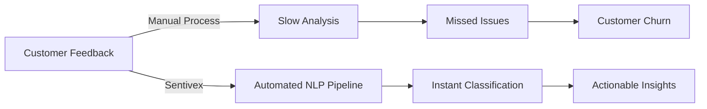
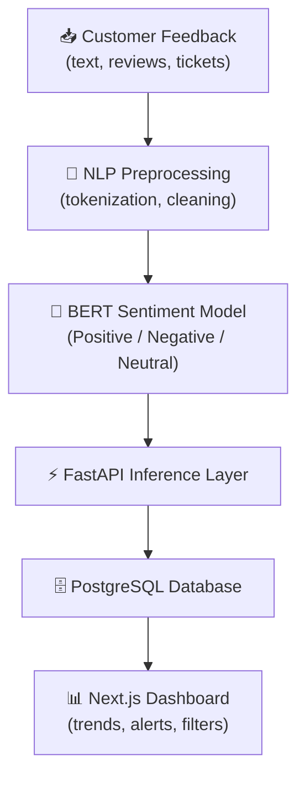
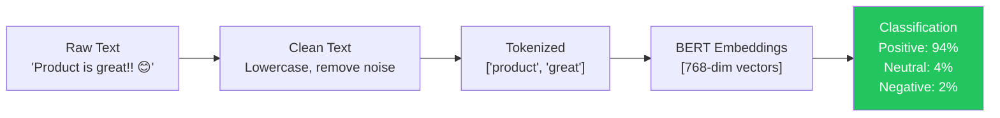
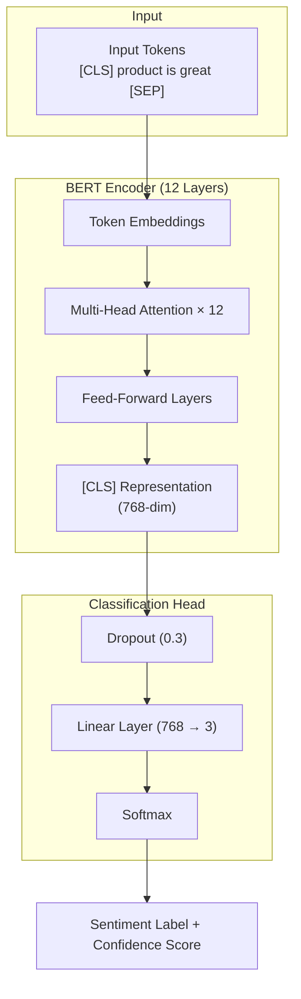
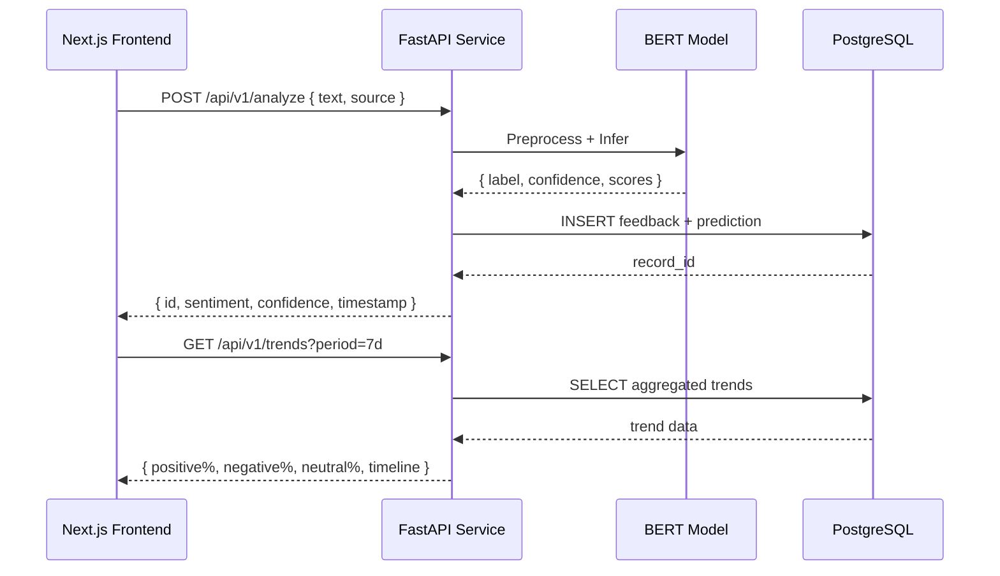
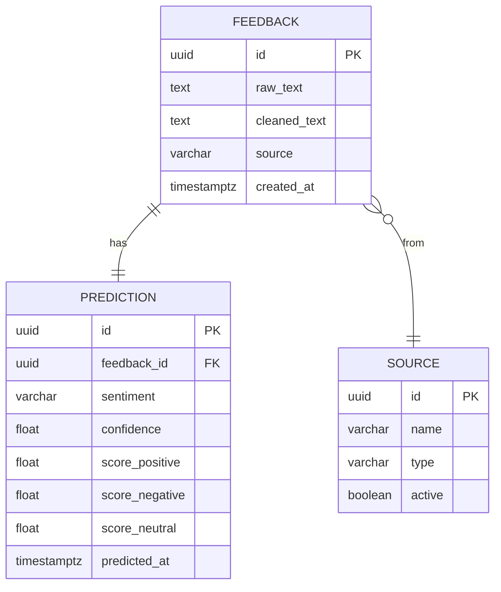
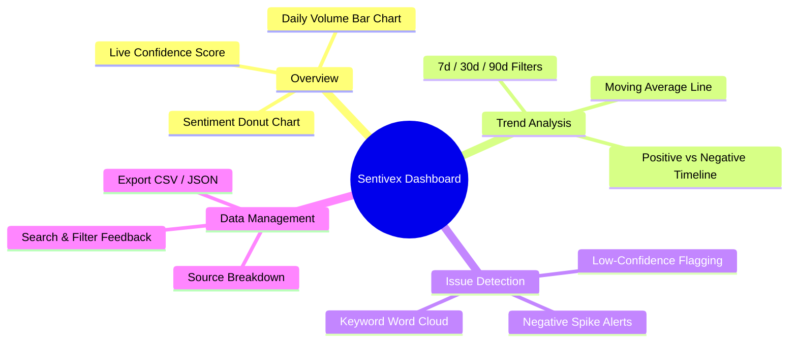
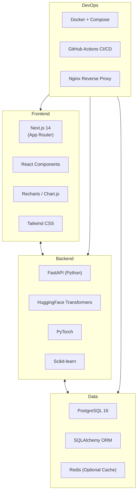
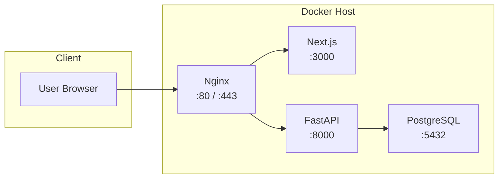
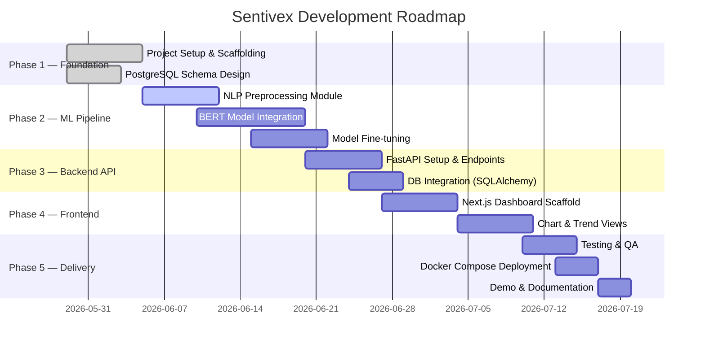

# Sentivex — AI Customer Sentiment Analysis Dashboard
### Slide Deck

---

## Slide 1 — Title

# SENTIVEX
**AI-Powered Customer Sentiment Analysis Dashboard**

> Automatically classify customer feedback and visualize sentiment trends in real time.

| | |
|---|---|
| **Stack** | Python · PostgreSQL · Next.js |
| **Model** | BERT (Transformer-based NLP) |
| **Interface** | Interactive Real-Time Dashboard |

---

## Slide 2 — Problem Statement

### The Challenge

- Businesses receive thousands of customer reviews, tickets, and messages daily
- Manual classification is slow, inconsistent, and unscalable
- Delayed response to negative sentiment leads to churn
- No centralized view of emotional trends over time



---

## Slide 3 — Solution Overview

### What Sentivex Does



---

## Slide 4 — System Architecture

### High-Level Architecture

```mermaid
C4Context
    title Sentivex — System Architecture

    Person(user, "Analyst / Business User", "Views sentiment trends on dashboard")

    System_Boundary(sentivex, "Sentivex Platform") {
        System(frontend, "Next.js Dashboard", "Real-time visualization & filters")
        System(api, "FastAPI Backend", "REST API for inference & data access")
        System(nlp, "NLP Pipeline", "Text preprocessing & BERT model")
        SystemDb(db, "PostgreSQL", "Stores feedback, predictions, metadata")
    }

    System_Ext(sources, "Feedback Sources", "CRM, emails, app reviews, chat logs")

    sources --> api
    user --> frontend
    frontend --> api
    api --> nlp
    api --> db
    nlp --> db
```

---

## Slide 5 — NLP Pipeline

### Text Preprocessing Flow



**Steps:**
1. HTML/emoji stripping, lowercasing
2. Punctuation normalization
3. HuggingFace BERT tokenizer (`bert-base-uncased`)
4. Softmax classification head (3 classes)

---

## Slide 6 — BERT Model Architecture

### Transformer-Based Sentiment Classifier



---

## Slide 7 — API Design

### RESTful Inference API (FastAPI)



---

## Slide 8 — Database Schema

### PostgreSQL Entity Model



---

## Slide 9 — Dashboard Features

### Next.js Interactive Dashboard



---

## Slide 10 — Technology Stack

### Stack Summary



---

## Slide 11 — Deployment Architecture



---

## Slide 12 — Key Metrics & Goals

| Metric | Target |
|---|---|
| Sentiment Accuracy | ≥ 90% (F1) |
| API Response Time | < 300ms (p95) |
| Dashboard Load Time | < 1.5s |
| Data Ingestion Rate | 100 req/s |
| Model: Precision | ≥ 88% per class |

---

## Slide 13 — Project Roadmap



---

## Slide 14 — Summary

### Sentivex Delivers

- **Automated** sentiment classification at scale with BERT
- **Real-time** inference via a low-latency FastAPI service
- **Persistent** storage of all feedback and predictions in PostgreSQL
- **Interactive** trends dashboard built with Next.js
- **Actionable** alerts for negative sentiment spikes

> Built to help businesses listen better, respond faster, and improve customer experience.
